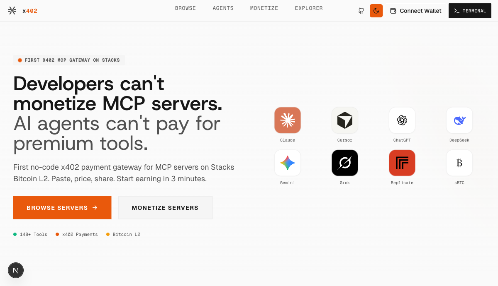

# stackai-x402

x402 HTTP payment protocol implementation for Stacks Bitcoin L2. Enables AI agents and developers to monetize MCP tool calls with STX, sBTC, or USDCx payments -- no custodial intermediaries, no subscriptions, pay-per-call.



## How x402 Works

```
Client                        Gateway                     MCP Server
  │                              │                            │
  │── POST /mcp?id=xxx ────────>│                            │
  │                              │── tool price > 0? ───────>│
  │<── 402 Payment Required ────│                            │
  │    (payment-required header) │                            │
  │                              │                            │
  │── sign tx locally           │                            │
  │── retry with payment ──────>│                            │
  │   (payment-signature header) │── settle on relay ──────>│
  │                              │<── settlement OK ────────│
  │                              │── forward to upstream ──>│
  │                              │<── tool result ──────────│
  │<── 200 + result ────────────│                            │
  │   (payment-response header)  │                            │
```

1. Client calls a tool through the gateway
2. Gateway returns HTTP 402 with a `payment-required` header (base64 JSON listing accepted tokens, price, recipient)
3. Client signs a Stacks transaction locally (private key never leaves the client)
4. Client retries the same request with a `payment-signature` header
5. Gateway settles the payment via an x402 relay and forwards the request to the upstream MCP server

## Packages

| Package | Path | Description |
|---------|------|-------------|
| [`stackai-x402`](packages/sdk/) | `packages/sdk/` | TypeScript SDK -- wallet generation, automatic 402 handling, agent management |
| [`gateway`](apps/gateway/) | `apps/gateway/` | HTTP gateway -- MCP proxy with x402 payment enforcement, server registry |
| [`web`](apps/web/) | `apps/web/` | Next.js dashboard -- marketplace, chat, agent composer, analytics |
| [`docs`](apps/docs/) | `apps/docs/` | Nextra documentation site |
| [`moltbook`](apps/moltbook/) | `apps/moltbook/` | Promotional AI agent service for the Moltbook social platform |

## Quick Start

### Prerequisites

- Node.js >= 18
- pnpm
- Redis (for gateway state and analytics)

### Install and Build

```bash
git clone https://github.com/Stack-AI-MCP/stackai-x402.git
cd stackai-x402

pnpm install
pnpm build          # builds SDK first, then gateway (turbo pipeline)
pnpm test           # runs all tests
```

### Consumer (Paying for Tools)

```typescript
import { createAgentClient, generateAgentWallet, getBalance } from 'stackai-x402'

// Generate a wallet (or use an existing private key)
const wallet = generateAgentWallet('mainnet')
console.log(wallet.address) // SP...

// Check balance
const balance = await getBalance(wallet.address, 'mainnet')

// Create an HTTP client with automatic 402 payment handling
const client = createAgentClient(wallet.privateKey, 'mainnet')

// Call a tool -- 402 responses are handled transparently
const response = await client.post('https://gateway.example.com/mcp?id=server123', {
  jsonrpc: '2.0',
  method: 'tools/call',
  params: { name: 'get-price', arguments: { token: 'STX' } },
  id: 1,
})
```

### Provider (Monetizing Tools)

```typescript
import { createAgent } from 'stackai-x402'

const agent = await createAgent('https://gateway.example.com', privateKey, {
  name: 'DeFi Agent',
  description: 'Bitcoin DeFi tools',
  tools: [
    { serverId: 'srv_abc', toolName: 'swap-tokens', price: 0.01 },
    { serverId: 'srv_abc', toolName: 'get-price', price: 0 },
  ],
})
```

See the [SDK README](packages/sdk/) for the full API reference.

### Running the Gateway

```bash
cp apps/gateway/.env.example apps/gateway/.env
# Set GATEWAY_ENCRYPTION_KEY, REDIS_URL, RELAY_URL

pnpm --filter gateway dev
```

See the [Gateway README](apps/gateway/) for environment variables and API routes.

### Running the Web Dashboard

```bash
pnpm --filter web dev
```

The dashboard runs at `http://localhost:3002`. Set `NEXT_PUBLIC_GATEWAY_URL` to point to your gateway.

## Development

```bash
pnpm dev             # start all packages in watch mode
pnpm --filter gateway dev    # gateway only
pnpm --filter web dev        # web dashboard only
pnpm --filter stackai-x402 build  # rebuild SDK
```

## Architecture

```
packages/sdk/src/
  client/     x402 payment client -- automatic 402 retry with signed payments
  server/     agent CRUD -- create, update, delete agents (signed requests)
  proxy/      wallet generation, balance checks, agent discovery
  hooks/      request lifecycle hooks (logging, monetization, analytics)
  types/      shared TypeScript types (AgentConfig, AgentTool, etc.)
  internal/   crypto utilities, price conversion (not re-exported)

apps/gateway/src/
  routes/     HTTP routes (proxy, servers, agents, analytics, agent-card)
  services/   auth (signature verification), registration (Redis storage)
  config.ts   environment variable schema (Zod validated)

apps/web/
  app/        Next.js App Router (marketplace, chat, register, agents, analytics)
  components/ UI components (landing, chat, agents, explorer, providers)
  hooks/      wallet auth, x402 client hooks
  lib/        utilities, x402 integration

apps/moltbook/src/
  ai/         LLM content generation (OpenAI, Anthropic, template)
  moltbook/   Moltbook API client with challenge solver
  scheduler/  Heartbeat engine (configurable intervals)
  state/      Agent state management

apps/docs/
  src/content/  MDX documentation (guides, reference, getting started)
```

## Supported Tokens

| Token | Network | Description |
|-------|---------|-------------|
| STX | mainnet, testnet | Native Stacks token |
| sBTC | mainnet, testnet | Wrapped Bitcoin on Stacks |
| USDCx | mainnet | Circle xReserve USDC on Stacks |

## License

MIT
